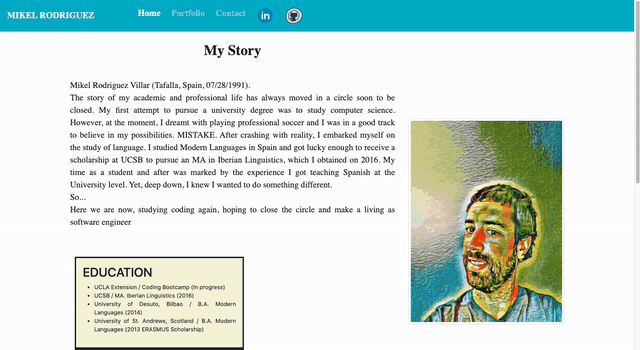

# MIKEL_PORTFOLIO

[Live site](https://mikeltafalla.github.io/MIKEL_PORTFOLIO/)

# Technologies Used

1. HTML
2. Bootstrap (makes use of Jquery)
3. CSS

# Table of Contents

* [Features](#features)
* [Example Gif](#example-gif)
* [Author](#author)

## Features
* Basic portfolio that contains three tabs. One with biographical info of the author of the portfolio. Another tab to contact the person and another tab displaying the projects in the portfolio.
* It includes links to Github and LinkedIn.

> Note: After including the different screen sizes where I needed the portfolio to be responsive, I found out that in order to add margins to the navbar in screens small or bigger, and eliminate the margins on xs screens, I needed to use @media queries. I include just that one (minimal) mediaquery, but I included it as a comment so it doesn't take effect. In case you want to test it you should uncomment it.

## Example Gif

## Author 

**MikelTafalla**

Email: mikel362d@gmail.com

Location: Santa Barbara

GitHub: https://github.com/MikelTafalla

